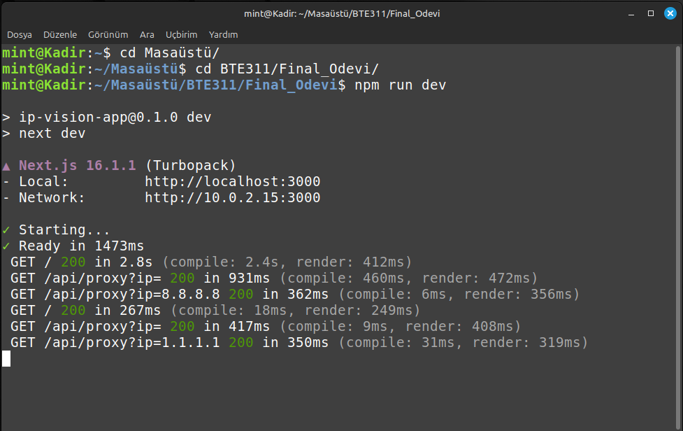
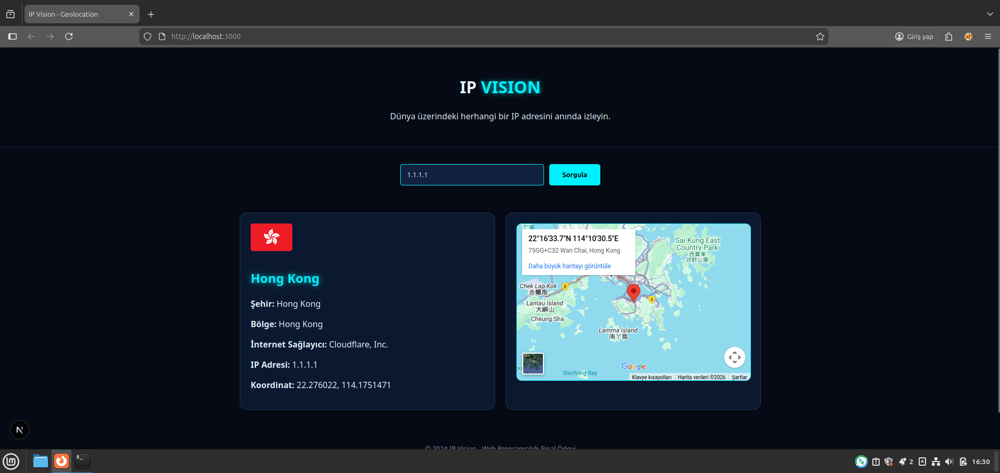

# IP Sorgulama React App

Web Tabanlı Programlama dersi final ödevi için **Next.js** ve **React** kullanılarak geliştirilmiş, dinamik IP sorgulama ve konum görüntüleme uygulamasıdır.

## Proje Görselleri

**Yerel Geliştirme Ortamı:**


<br>

<br>

**Uygulama Arayüzü (Örnek Sorgu):**


<br>

<br>

## Kullanılan Teknolojiler ve API

* **Framework:** Next.js / React
* **API Kaynağı:** [https://ipwho.is](https://ipwho.is)
* **Harita:** Google Maps Embed API

## Kurulum ve Çalıştırma

Projeyi bilgisayarınızda çalıştırmak için terminali açın ve sırasıyla şu komutları uygulayın:

1.  Gerekli paketleri yükleyin:
    ```bash
    npm install
    ```
2.  Projeyi başlatın:
    ```bash
    npm run dev
    ```
3.  Tarayıcınızdan şu adrese gidin:
    `http://localhost:3000`

---
**Hazırlayan:** Kadir Duyar
**Öğrenci No/Ders:** 2230780028/BTE311
