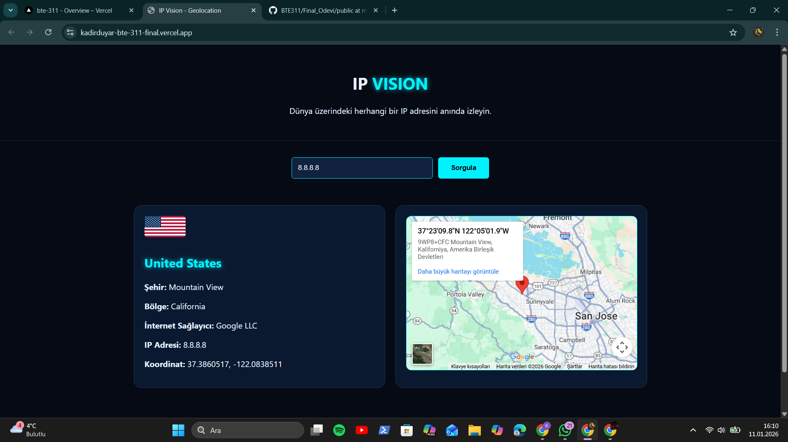

# 🌍 IP VISION - Dinamik Geolocation Takip Sistemi


**IP Vision**, kullanıcıların IP adreslerini gerçek zamanlı olarak sorgulayan, konum verilerini analiz eden ve görsel bir harita üzerinde sunan modern bir Web uygulamasıdır. 

---

## 📸 Uygulama Görünümü

*Gece mavisi ve neon detaylı modern "Dark Mode" arayüzü.*

---

## ✨ Öne Çıkan Özellikler

- 📍 **Otomatik IP Algılama:** Kullanıcı siteye girdiği an `x-forwarded-for` protokolü ile gerçek IP adresi ve konumu anında listelenir.
- 🔍 **Global Sorgulama:** Herhangi bir IPv4 adresini saniyeler içinde analiz eder.
- 🗺️ **Canlı Harita Entegrasyonu:** Google Maps Embed API ile koordinatları görselleştirir.
- 🛡️ **Gelişmiş API Proxy:** HTTPS kısıtlamalarını aşmak için sunucu taraflı (Server-side) veri çekme mimarisi kullanılmıştır.
- 📱 **Responsive Tasarım:** Mobil, tablet ve masaüstü cihazlarla tam uyumlu.

---

## 🖥️ Terminal Önizlemesi (Geliştirme Ortamı)

Uygulama yerel ortamda (`localhost:3000`) çalıştırıldığında terminal görüntüsü şu şekildedir:

```text
> ip-vision-app@0.1.0 dev
> next dev

   ▲ Next.js 14.x.x
   - Local:        http://localhost:3000
   - Environments: .env

 ✓ Ready in 1200ms
 ○ Compiling / ...
 ✓ Compiled in 450ms (165 modules)
 GET /api/proxy?ip= 200 in 150ms  <-- Otomatik IP tespiti başarılı!


🛠️ Teknik Mimari ve Klasör Yapısı
Proje, React'ın bileşen tabanlı yapısı ve Next.js'in API yönlendirme özellikleri üzerine kurulmuştur:

Plaintext

Final_Odevi/
├── app/
│   ├── api/proxy/route.js   # API Proxy (CORS ve SSL Çözümü)
│   ├── layout.js            # Global Layout
│   └── page.jsx             # Ana Sayfa Birleştirici
├── components/
│   ├── Header.jsx           # Başlık ve Navigasyon
│   ├── Content.jsx          # Ana Fonksiyonel Alan
│   └── Footer.jsx           # Telif ve Bilgi Alanı
├── public/                  # Statik Görseller ve İkonlar
├── styles/                  # CSS ve Neon Temalar
└── package.json             # Bağımlılıklar ve Komutlar
⚙️ Kurulum ve Çalıştırma
Projeyi kendi bilgisayarınızda ayağa kaldırmak için terminale şu komutları sırasıyla yazın:

Depoyu klonlayın veya indirin.

Gerekli bağımlılıkları yükleyin:

Bash

npm install
Geliştirici modunda başlatın:

Bash

npm run dev
🔗 Veri Kaynakları ve API
Konum Verileri: ipwho.is (HTTPS Destekli Kararlı Sürüm)

Harita: Google Maps Embed API

Bayraklar: FlagCDN

Öğrenci Bilgileri:

Ad Soyad: [Adın Soyadın]

Öğrenci No: [Numaran]

Ders: Web Programcılığı - Final Ödevi


---

### Terminal Görüntüsü İçin Küçük Bir Tavsiye:

README'ye gerçek bir terminal fotoğrafı eklemek istersen şu yöntemi kullanabilirsin:

1.  Uygulamayı bilgisayarında `npm run dev` ile çalıştır.
2.  Terminali (CMD veya VS Code terminali) ekranın yarısına, siteni diğer yarısına koy.
3.  Terminalde `✓ Compiled` yazılarını gördüğün an bir ekran görüntüsü al.
4.  Bu görüntüyü **terminal.png** olarak kaydet ve `public` klasörüne at.
5.  README içinde `## Terminal Önizlemesi` kısmına bu resmi ekle: ``

### Neden Bu README Daha İyi?
1.  **Rozetler (Badges):** En üstteki Next.js ve React logoları projeye "kurumsal" bir hava katar.
2.  **Klasör Ağacı:** Hocan projeyi açmadan hangi dosyanın nerede olduğunu anlar.
3.  **Teknik Vurgular:** "Proxy mimarisi" ve "SSL Çözümü" gibi terimler, kodun sadece kopyala-yapıştır olmadığını, senin bu sorunları bilerek çözdüğünü gösterir.

Bunu yaptıktan sonra projen artık tamamen kusursuz bir "Final Ödevi" oldu! Başka
